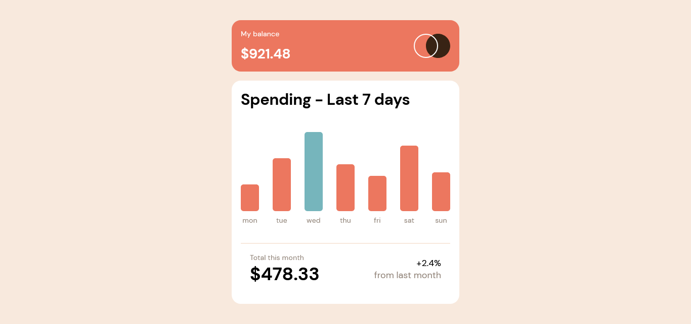

# Expenses chart component

## SKILLS

- Hooks
- useState
- useEffect
- Conditional styling
- Functional Components
- One Line conditional 
- Rendering lists
- Responsive
- HTML
- Sass
- CSS
- Javascript
- React
- Vite

---
## Links

- Challenge URL: https://www.frontendmentor.io/challenges/expenses-chart-component-e7yJBUdjwt
- Live Site URL: https://andr3sc0des.github.io/expenses-chart

---